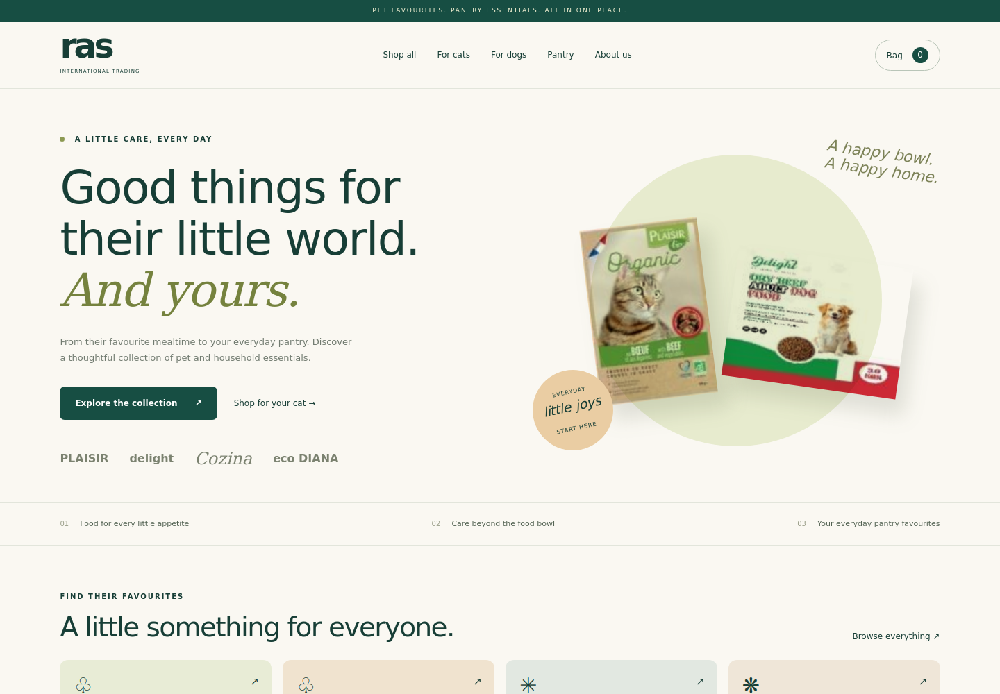

# RAS ecommerce development

A working local storefront and administration app for RAS International Trading WLL. Hosting and changes to rasqatar.com are intentionally deferred.



## Run on your laptop

Python 3.10 or newer is required. There are no Python package dependencies.

```bash
git clone https://github.com/AmirSabeel/Cat-food.git
cd Cat-food
python server.py
```

Open **http://127.0.0.1:8000**. On systems where Python is named `python3`, use that instead. Run the server rather than opening index.html directly: products, settings and checkout use the local API.

To create an administrator, open a second terminal in the project folder:

```bash
python manage.py
```

Choose a username and a password of at least 12 characters. No default password exists. Sign in at **http://127.0.0.1:8000/admin**. Running manage.py again for the same username resets that account's password and revokes its sessions.

## What works

- Responsive storefront, categories, brand filters, search, sorting and product details.
- 84 unique barcode entries imported from four unique supplier PDFs. The duplicate PLAISIR file was excluded.
- Original product images extracted from the supplier PDFs. Image resolution is limited by the source files.
- Browser-local bag with quantity changes, removal and persistence.
- Customer enquiries saved in SQLite with reference numbers and visible to administrators.
- Admin sign-in, product name/visibility editing, selling unit, price confirmation and stock management.
- Delivery areas, delivery fees, minimum order and cash-on-delivery enablement.
- Cash-on-delivery checkout for confirmed, available products when ordering is enabled.
- Server-calculated totals, price-change checks, transactional stock reservation and idempotent submissions.
- Order fulfilment stages, cancellation with stock restoration, and explicit recording of cash collected after delivery.

## Defaults and client decisions

Online ordering is **disabled** initially. No retail selling prices, pack units, stock quantities or delivery areas are invented. Public products show **Price on request** until approved. Supplier prices, box prices, carton quantities and source references are available privately in the admin product editor.

To enable cash-on-delivery orders:

1. In Products, enter each product's approved selling price in QAR, selling unit and available quantity. Tick **Price and selling unit confirmed**.
2. In Store settings, set supported delivery areas, the delivery fee and any minimum order. Enable cash-on-delivery orders when the client is ready.
3. Unconfirmed or unavailable products still accept an enquiry. A mixed bag containing an unconfirmed product uses the enquiry flow, without reserving stock or collecting payment.

The Cozina PDF does not explicitly label its currency. Multipacks and carton/unit pricing need client confirmation. Categories are an initial merchandising classification and should be reviewed, especially treats. Do not treat supplier descriptions as verified feeding or health advice.

## Data and security

The app initializes `data/ras.sqlite3` on first run. This contains products, settings, accounts, sessions, enquiries and orders. It is excluded from git, as are local environment files. Stop the development server before making a simple file-copy backup of the database. Never upload customer databases to this public repository.

`products.json` is a seed catalogue, not the live database: restarting does not overwrite admin edits. No private customer data or test credentials are included in source control.

Administrator passwords use salted PBKDF2 hashes. Sessions use opaque tokens, HttpOnly/SameSite cookies, expiry and CSRF checks. Mutations require a same-origin JSON request. Login and enquiry requests have basic rate limits. Order totals, availability and stock are verified server-side. Public APIs do not expose enquiries or supplier pricing; internal files cannot be served through the web server.

Environment options:

- `RAS_DB`: alternate SQLite path, useful for isolated tests.
- `RAS_SECURE_COOKIES=1`: use Secure session cookies when running behind HTTPS.
- `python server.py --port 8000`: choose a local port. The default bind address is 127.0.0.1.

## Tests

Product details have direct `#product/<barcode>` links with copy-link actions. Browser Back/Forward restores catalogue filters and scroll position. Mobile bag controls use larger touch targets; unchanged carts retain checkout retry keys to help prevent duplicate requests after connection failures.

```bash
python -m unittest discover -s tests -v
```

The 12 HTTP integration tests cover access controls, CSRF/origin validation, price/stock validation, duplicate submissions, rollback, competing orders, fulfilment, cash collection and cancellation. They create their own temporary database and never use the store database.

With Playwright and Chromium installed, run `node tests/navigation.cjs` against a local server. Optional `RAS_TEST_URL` and `RAS_BROWSER_PATH` select the local URL and browser executable. This check covers product links, reload, history navigation, restored filters, copy links, cart retry keys, quantity limits and mobile touch targets.

Browser checks also passed at desktop (1440 × 1000) and mobile (390 × 844) sizes: filtering, search, product detail, bag persistence, enquiry submission, admin login, product editing, delivery setup, cash-on-delivery checkout, fulfilment and cash collection. No browser JavaScript errors were observed. The check identified and fixed stale delivery settings: the bag and checkout now refresh current product/settings data.

## Remaining before public launch

This is a tested **development application**, not a deployed or fully hardened production service. Python's built-in HTTP server is for local development. Production deployment requires an appropriate server/application integration, HTTPS, backups, monitoring and a deployment/security review. No hosting or domain changes have been made.

Not yet integrated: card payment gateway and signed payment webhooks, automatic email/SMS/WhatsApp notifications, refunds, customer accounts, password recovery and automated tax handling. Submitted requests are stored for staff to review; the app does not send notifications. Card payments require the client's chosen provider and merchant credentials, kept out of source control.

The client also needs to approve the final product scope, retail/wholesale units, prices/currency, stock, delivery terms, contact details, branding, high-resolution photos, privacy/returns policies and any applicable tax settings before accepting live customers.
